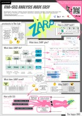

<figure markdown>
  { width="384" }
</figure>

# ZARP-cli

**Welcome to the _ZARP-cli_ documentation pages!**

_ZARP-cli_ is a simple command-line interface for the [_ZARP_][zarp] workflow
for RNA-Seq analysis.

Sounds boring? Well, _ZARP-cli_ doesn't just trigger _ZARP_, but rather
supercharges it by providing the following features:

!!! tip "Automatically download samples from the [Sequence Read Archive (SRA)][sra]"
!!! tip "Automatically download genome annotations with [_genomepy_][genomepy]"
!!! tip "Automatically infer metadata with [HTSinfer][htsinfer] (experimental!)"
!!! tip "Manage _ZARP_ run data and resources in one central, configurable location"

Once _ZARP-cli_ is [installed](guides/installation.md) and
[configured](guides/initialization.md), you may be able to _ZARP_ an RNA-Seq
library with a command like this:

```bash
zarp SRA1234567
```

***Does it get easier than that?*** :nerd:

!!! question "Where to go from here?"

    Use the menu on the left or the search bar in the page header to navigate
    through the documentation.

## How does it work?

> _"Any sufficiently advanced technology is indistinguishable from magic."_  
> — Arthur C. Clarke

At the risk of demystifying the magic, let's take a look at how _ZARP-cli_
works:

Briefly, when the program is triggered, a [_ZARP-cli_ configuration
object](docstring/config.models.md#Config) is constructed from parsing [default
configuration
settings](guides/initialization.md#modifying-configuration-settings) and
[command-line options](guides/usage.md#command-line-options). A user-specified
list of [sample references](guides/usage.md#sample-references) of various
supported types is then attached to the configuration object and de-referenced
to construct a (potentially) sparse data frame of sample metadata. If
necessary, this data frame of samples is then successively completed by
applying various sample processor plugins that are built on tools such as
[`genomepy`][genomepy] and [HTSinfer][htsinfer].

For example, if only a remote sample identifier is provided for a given sample,
the sample will first be fetched from the remote database via a custom
[Snakemake][snakemake] workflow based on the [SRA Toolkit][sra-toolkit]. Via
another custom Snakemake workflow, HTSinfer will then try to infer required
metadata such as the source organism and the read orientation from the sample
itself. If successful, `genomepy` then uses the source organism information to
fetch the corresponding genome and gene annotations and further amends the
sample data frame with this information. At this point, if any metadata is
still missing, defaults from the user configuration are applied or dummy data
appended, if possible/sensible. If at the end of this process enough
information is available to start a _ZARP_ run, the sample will be analyzed.

## How to cite


If you use _ZARP_ in your work (with or without _ZARP-cli_), please kindly cite
the following article:

**ZARP: A user-friendly and versatile RNA-seq analysis workflow**  
_Maria Katsantoni, Foivos Gypas, Christina J. Herrmann, Dominik Burri, Maciej
Bak, Paula Iborra, Krish Agarwal, Meric Ataman, Máté Balajti, Noè Pozzan, Niels
Schlusser, Youngbin Moon, Aleksei Mironov, Anastasiya Börsch, Mihaela Zavolan,
Alexander Kanitz_  
**F1000Research 2024, 13:533**  
<https://doi.org/10.12688/f1000research.149237.1>

[Download BibTeX citation :download: ](https://f1000research.com/articles/exportTo?versionId=163676&bibliographyReaderFormat=BIBTEX){ .md-button }

## Info materials

### Posters

<p float="left">
  <a href="https://f1000research.com/posters/13-968"></a>
  &nbsp; &nbsp; &nbsp;
  <a href="https://f1000research.com/posters/12-621"></a> 
</p>

## Reach out

There are several ways to get in touch with us:

- For ZARP usage questions, please use the [_ZARP_ Q&A forum][zarp-qa]
  (requires [GitHub registration][github-signup]).
- For feature suggestions and bug reports, please use either the
  [ZARP-cli][zarp-cli-issue-tracker] or [ZARP issue
  tracker][zarp-issue-tracker] (require [GitHub registration][github-signup]).
- For any other requests, please reach out to us via [email][contact].

## Contributing

We always welcome and duly acknowledge open source contributors, for
[_ZARP-cli_][zarp-cli], [_ZARP_][zarp] or any other of [our
projects][zavolab-gh]. Simply follow our [onboarding
instructions][contributing] and please mind our [Code of Conduct][coc]. If you
have any questions, do not hesitate to shoot us us an [email][contact].

## Acknowledgements

[](https://www.biozentrum.unibas.ch/research/research-groups/research-groups-a-z/overview/unit/research-group-mihaela-zavolan)
[](https://www.biozentrum.unibas.ch/)
[](https://www.sib.swiss/)
